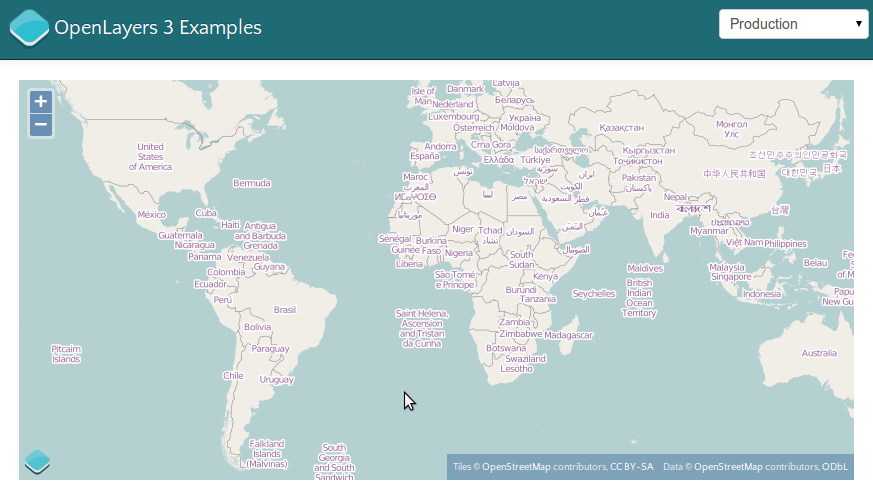

# OpenLayers 3 – Einführung, Verwendungsbeispiele und technische Highlights
## Marc Jansen & Andreas Hocevar

OpenLayers ist eine OpenSource JavaScript Kartenbibliothek mit sehr großer Verbreitung, sowohl innnerhalb von OSGeo-Projekten als auch in privaten wie öffentlichen Webseiten und Internet-/Intranet-Applikationen. Die 2.x-er Versionen der Software werden bis zum heutigen Tage weiterentwickelt und gepflegt. Doch natürlich nagt der Zahn der Zeit auch an OpenLayers: Entwickler und Anwender haben 2014 verständlicherweise andere Ansprüche an digitale Kartenbibliotheken, als dies vor 8 Jahren der Fall war.
Bereits seit einiger Zeit wird daher von der Entwicklergemeinde an OpenLayers 3 gearbeitet, zum Zeitpunkt der Einreichung dieses Artikel ist die aktuellste Version 3.0.0.beta.1.

### Was ist neu bei OpenLayers3?

OpenLayers3 (ol3, http://ol3js.org/) wurde von Grund auf neu entwickelt und daher ist de facto alles neu an der Bibliothek.

Das neue ol3 basiert auf der Funktionalität der JavaScript-Bibliothek Google Closure (https://developers.google.com/closure/library/), die auch in zahlreichen Google Produkten (etwa Gmail oder Google Maps) verwendet wird. Closure wird in ol3 vor allem verwendet, um das Klassensystem bereitzustellen, wiederkehrende Aufgaben (wie etwa HTML-Elementerzeugung, Eventhandling und DOM-Manipulation) zu lösen und um von der stärkestmöglichen Kompression des Tools Closure Compiler (https://developers.google.com/closure/compiler/) zu profitieren. Insbesondere der letzte Punkt garantiert eine sehr kleine Dateigröße der zusammengefassten und komprimierten ol3-JavaScript-Datei. Die finale ol3-Bibliothek ist aber natürlich auch ohne Google Closure zu benutzen. Bereits in der Entwicklung wurde wert darauaf gelegt, dass ol3 unproblematisch auch mit anderen JavaScript-Frameworks oder Bibliotheken einzusetzen ist.

Die sicherlich bemerkenswerteste Neuerung von ol3 ist die zusätzliche Unterstützung von WebGL als Rendering Engine. WebGL erlaubt es, in modernen Browsern hardwarebeschleunigte 3D-Grafiken darzustellen und dies ohne zusätzliches Plugin. Unterstützung für WebGL ist in den aktuellen Versionen der Browser Google Chrome, Chromium, Opera, Firefox & Internet Explorer 11 bereits integriert. Mit WebGL-Unterstützung in ol3 ist es nunmehr möglich, mit einer Bibliothek sowohl hochperformante 2D Karten im Web darzustellen, als auch virtuelle Globen zu erstellen, die im Browser bedient werden. Hier wird insbesondere mit den Entwicklern der Cesium Bibliothek (http://cesiumjs.org/) eng zusammengearbeitet. Mit der aktuellen Version von ol3 (beta.1), Ist die Erstellung von virtuellen Globen derzeit nicht möglich, die grundsätzliche Funktionalität und Architektur ist jedoch bereits implementiert. 

OpenLayers 2 wurde lange vor dem Boom des mobilen Internets, auf welches via Smartphones und Tablets zugegriffen wird, entwickelt. Die Unterstützung mobiler Endgeräte wurde zwar nachgerüstet und ist funktional, doch ol3 unterstützt mobile Endgeräte von Anfang an. Hierbei wurden in der Entwicklung stets die besonderen Limitierungen (langsame/instabile Netzverbindung, kleiner Arbeitsspeicher, vergleichsweise kleiner Bildschirm etc.) und zusätzlichen Möglichkeiten (MultiTouch-Bedienung, Rotation des Gerätes, HTML5-APIs etwa zur Geolokalisierung, etc.) mobiler Geräte beachtet.

Zwei größere Kritikpunkte an OpenLayers 2 waren die z.T. fragmentierte und unvollständige Dokumentation und die Schwierigkeit, eine speziell optimierte Version von OpenLayers zu erzeugen, die nur enthält, was man wirklich benötigt (sogenannter custom build). Hier möchte ol3 besser sein: Bereits heute ist es möglich, die Bibliothek so zu nutzen, dass ein minimaler build einfach zu erzeugen ist. Geplant sind hier weitere Tools und/oder Applikationen, die diese Anpassungen noch einfacher für Endanwender und Programmierer machen.

Bei der Dokumentation der öffentlichen Schnittstelle setzt ol3 auf das Programm jsdoc3 (http://usejsdoc.org/), welches bereits hervorragende, komplette und konsistente Dokumentation produziert (vgl. http://ol3js.org/en/master/apidoc/). Hier sind sicherlich noch weitere Anpassungen und Ergänzungen seitens der ol3-Entwickler vorzunehmen, aber wir sind sicher, die Qualität der Dokumentation hoch zu halten.

### Was bleibt gleich?

Auch wenn der Code neu geschrieben wurde, so sind doch die Ziele hinter OpenLayers unverändert. Auch ol3 ist:

* Vielseitig verwendbar
* Modern implementiert
* Performant programmiert
* Erweiter- und anpassbar
* Einfach zu verstehen
* Standardkonform
* Cross-Anything (Browser, Platform & Endgerät)
* Vollständig dokumentiert
* Verlässlich in der Verwendung

Die Bibliothek ol3 erlaubt zahlreiche Verwendungsmöglichkeiten und stellt dem Entwickler die Werkzeuge bereit, um so unterschiedliche Aufgaben wie einen einfachen Kartenviewer für eine Homepage zu erzeugen aber auch eine komplette webbasierte GDI (Geodaten Infrastruktur) mit optionaler 3D Visualisiserung umzusetzen.

Moderne Webtechnologien sind auch in OpenLayers 2.x verwendbar gewesen. ol3 macht eben dort weiter und unterstützt zahlreiche HTML5-APIs, das bereits erwähnte WebGL und nutzt die Möglichkeiten von CSS3 wo möglich und sinnvoll.

Performance ist in ol3 von hoher Bedeutung. Dies betrifft im wesentlichen zwei Aspekte: Einerseits sollte die Bibliothek die kleinstmögliche Dateigröße haben (vgl. Verwendung von Closure Compiler, s.o.) und andererseits sollten interne Methoden so performant wier möglich programmiert sein. Beide Aspekte haben in der Entwicklung von ol3 einen hohen Stellenwert.

Eine Bibliothek kann nie alles für jeden Entwickler und Anwendungsfall bereitstellen. Auch ol3 möchte es den Benutzern von ol3 einfach machen, das Verhalten von ol3 zu erweitern oder zu beeinflussen. Via Events kann der Entwickler bereits jetzt an entscheidenden Stellen auf Darstellung und Verhalten der Bestandteile von ol3 einwirken. Alle visuellen Elemente von OpenLayers lassen sich einfach mittels CSS an eigene Bedürfnisse anpassen.

Hauptaugenmerk von OpenLayers 2 war und ist es, einfach bedien- und verwendbar zu sein. Auch ol3 legt hier einen Schwerpunkt. Die API von ol3 ist so konzipiert, dass Sie vom Anwender einfach erfasst werden kann und keine inhaltlichen Brüche zeigt. Verwendet man erfolgreich Komponente A in einer bestimmten Weise, kann man sich darauf verlassen, dass eine ähnliche Komponente B sich i.d.R. nahtlos anstelle von A verwendet werden kann. Hier ist natürlich auch das frühe Feedback der Anwender hochgeschätzt. Noch ist die API an vielen Stellen im Fluss, daher ist die Diskussion um jene gerne gesehen.

ol3 wird die bekanntesten und weit verbreiteten Standards (etwa des OGCs) wie WMS, WFS etc. natürlich unterstützen. Zusammen mit den Zielen des Cross-Everything (Funktionalität ist browser-, plattform- und Endgeräteunabhängig gewährleistet) kann man mit ol3 zukunftsfähige Applikationen entwickeln.

Durch eine vollständige Dokumentation der API und ergänzende Tutorials sowie eine breit getestete Funktionalität ist ol3 bereits heute vor allem eines: Verlässlich. OpenLayers 2.x hat in in den letzten acht Jahren bei insgesamt 13 neuen Releases stets die bekannte API nicht gebrochen, so dass ein Upgrade der OpenLayers-Version i.d.R. trivial war. Hier möchte ol3 aufbauen und das Vertrauen in die Updatefähigkeit nicht enttäuschen.

### Verwendungsbeispiele

Was kann ol3 nun schon zum jetzigen Zeitpunkt? Im Folgenden werden wir drei aktuelle offizielle Beispiel kurzvorstellen und auch auf zwei Realweltanwendungen, die ol3 verwenden, verweisen.

Das Beispiel "Simple example" (http://ol3js.org/en/master/examples/simple.html) zeigt, wie die Hauptkomponententen `ol.Map`, `ol.layer.Layer` (hier ein `Tile`-Layer) und `ol.View2D` zu verwenden sind:

```javascript
var map = new ol.Map({
  layers: [
    new ol.layer.Tile({
      source: new ol.source.OSM()
    })
  ],
  renderers: ol.RendererHints.createFromQueryData(),
  target: 'map',
  view: new ol.View2D({
    center: [0, 0],
    zoom: 2
  })
});
```

Die `ol.Map` als Kernkomponente von ol3 benötigt i.d.R. wenigstens Ein Kartenthema, eine Viewdefinition (im Falle einer 2D-Karte üblicherweise mit Zentrum und Zoomlevel) sowie ein HTML-Element in welchem die Karte gerendert werden soll (`target: 'map'`, hier ist `map` die `id` eine `<div>`-Elements auf der Seite).

Mit diesen 12 Zeilen Code wird auf der Webseite eine vollfunktionale Karte gezeichnet, die eine OpenStreetMap-Quelle verwendet (`ol.source.OSM`):



Am nächsten Beispiel "IGC Example" (http://ol3js.org/en/master/examples/igc.html), werden wir sehen, dass ol3 auch eine Vielzahl von Vektordaten performant darstellen und mit jenen interagieren kann.

Im Beispiel werden 5 Paragliderflüge im IGC-Format (vgl. http://www.ukiws.demon.co.uk/GFAC/documents/tech_spec_gnss.pdf) als Quelle (ol.source.IGC) für einen Vektorlayer verwendet, die insgesamt beinahe 50.000 unterschiedliche Koordinaten enthalten. Beim Überfahren der Karte mit der Maus
werden Informationen zum dem Mauszeiger am nächsten befindlichen Flug angezeigt.
Diese Interkation mit der Karte geschieht über einen `mousemove`-EventHandler auf einem ol3-Element (im Code unten nicht aufgeführt).

```javascript
// ...
// Code vereinfacht aus online Beispiel
//
// Erzeugung der vectorSource:
var vectorSource = new ol.source.IGC({
  urls: [
    'data/igc/Clement-Latour.igc',
    'data/igc/Damien-de-Baenst.igc',
    'data/igc/Sylvain-Dhonneur.igc',
    'data/igc/Tom-Payne.igc',
    'data/igc/Ulrich-Prinz.igc'
  ]
});
// Erzeugung einer Funktion, die das Aussehen der
// Features je Auflösung bestimmt (gekürzt):
var styleFunction = function(feature, resolution) {
  // ...
  return styleArray;
};
// ...
// Verwendung der source in ol.layer.Vector:
var layer = new ol.layer.Vector({
  source: vectorSource,
  styleFunction: styleFunction
});
// ...
```

SCREENSHOT


* Beispiel: drag drop image (formate & interaktiv)
* OpenGeoSuite (pluggable + standards + Product ready)
* swisstopo (realworld)
  * Code https://github.com/geoadmin/mf-geoadmin3
  * URL http://map.geo.admin.ch/
  * ol3, Angular JS + Bootstrap

### Technische Highlights

* Layer spy + layer swipe
  * Events und Canvas2D
  * postcompose
  * precompose

* d3 example
  * ol.layer.Image
  * Zusammenspiel mit 3rd party

* layergroup
  * gemeinsame API
  * Bildmanipulation WebGL


### Kontakt zu den Autoren:

Marc Jansen<br/>
terrestris GmbH & Co. KG<br/>
Pützchens Chaussee 56<br/>
53227 Bonn<br/>
+49 228 – 962 899 53<br/>
jansen@terrestris.de

Andreas Hocevar<br/>
Boundless<br/>
222 Broadway, 19th Floor<br/>
New York, NY 10038, USA<br/>
+1 877 – 673-6436<br/>
ahocevar@boundlessgeo.com


### Literatur

todo
